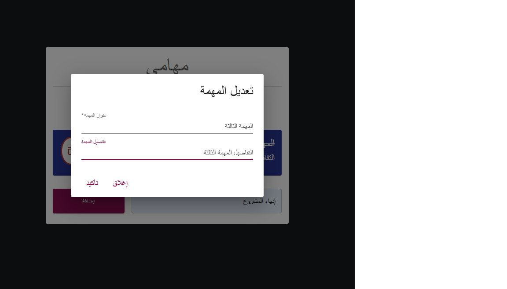
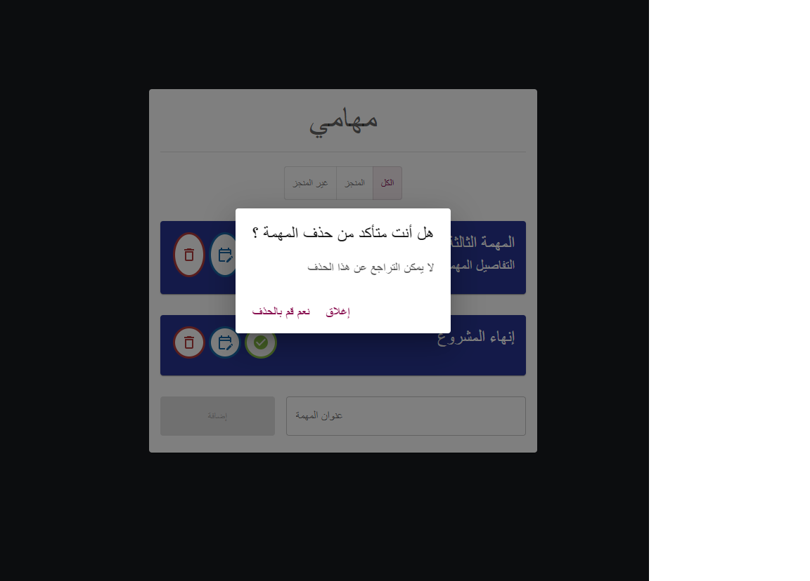
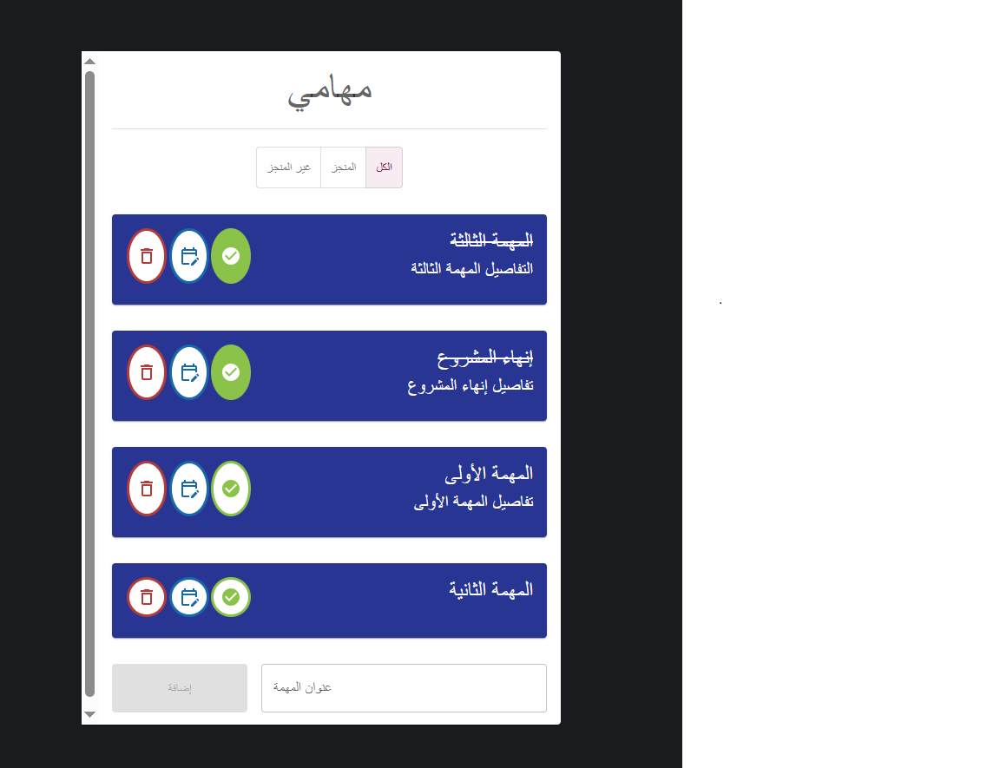
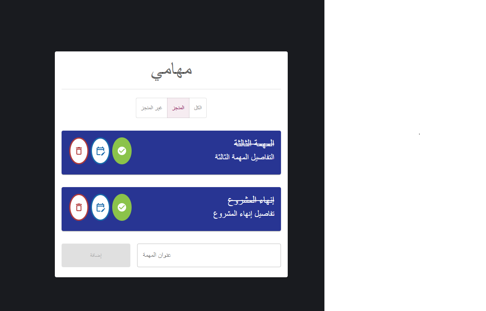
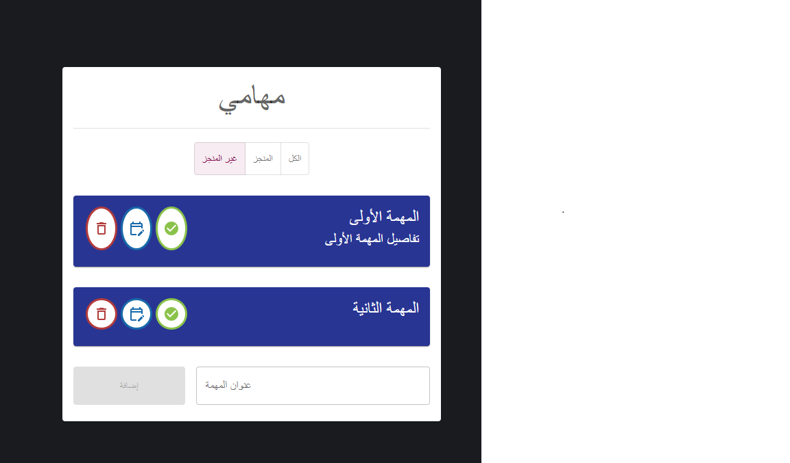
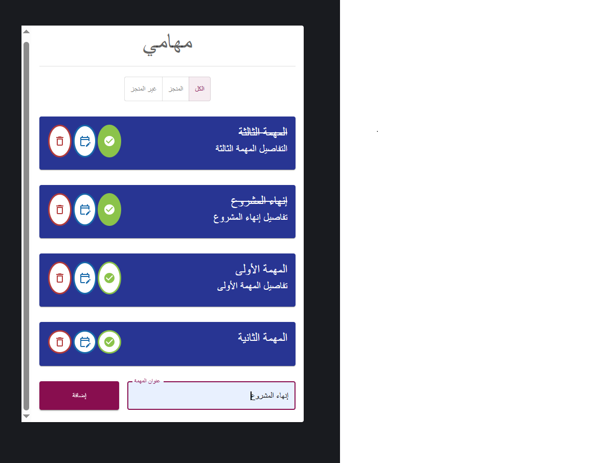

# First React App

📌 About the Project
**First React App** is a web application built using **React 18** as the core library for frontend development. The project leverages **Material UI (MUI)** to deliver modern and  user interfaces.

🚀 Features
- **Modern UI Design:** Crafted with Material UI components and icons for a consistent and responsive user experience.
- **Unique ID Generation:** Integrates the `uuid` package to generate unique identifiers for data and components as needed.
- **State Management: Uses React useState for managing component state.
- **User Interaction: Handles user actions and events.
- **Conditional Rendering: Displays UI elements based on application state.
- **Modal Component: Uses modal components for displaying additional content or user interactions.
- **Component-Based Architecture: Builds the application using reusable React components.

🛠️ Technologies Used

-React (v18.3.1): Core library for building user interfaces.
-JavaScript: Programming language used for application logic.
-HTML: Used for structuring the application.
-React Hooks: useState, useContext, useEffect, and useReducer.

### Frontend & UI
- **React (v18.3.1):** Core library for building user interfaces and component architecture.
- **React DOM (v18.3.1):** Rendering engine for interfacing with the DOM.
- **Material UI (`@mui/material` v9.4.0 & `@mui/icons-material` v9.4.0):** Comprehensive UI component and icon library.
- **Emotion (`@emotion/react` & `@emotion/styled` v11.14):** Styling engine powering Material UI.

📁 Project Structure
first-react-app/
├── public/
├── src/
├── .gitignore
├── package.json
├── package-lock.json
└── README.md

⚙️ Installation & Setup
To run this project locally, follow these steps:

1. Clone the Repository
Bash
git clone <REPOSITORY_URL>
cd first-react-app
2. Install Dependencies
Bash
npm install
3. Start the Application
Bash
npm start
The application will run in development mode at: http://localhost:3000

📜 Available Scripts
npm start - Runs the app in development mode.

npm test - Launches the test runner in interactive watch mode.

npm run build - Builds the app for production to the build folder.

npm run eject - Removes the single build dependency (one-way operation).

🎯 Learning Goals

This project was created to practice and understand:

React fundamentals and component-based development.
React Hooks and state management.
Creating reusable React components.
Handling forms and user interactions.
Conditional rendering.
Building UI elements using Material UI.
Managing npm dependencies and project structure.

🖼️ Project Preview

👩‍💻 Author
Eng. Heba Shamsene
